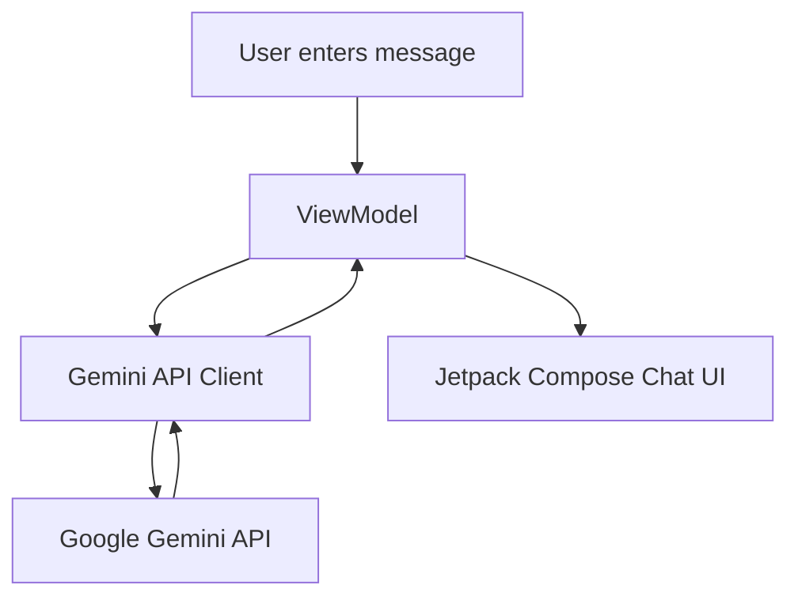

# Android App — Chat with Gemini 

An Android app that integrates with **Google’s Gemini API** to provide a simple **chat interface** where users can send prompts and receive AI-generated responses. Built with **Kotlin**, **Jetpack Compose**, and modern Android libraries.

---

##  Features

- **Chat Interface**: Clean UI to enter a prompt and view AI responses  
- **Gemini API Integration**: Uses Google’s Gemini model for generating answers  
- **Asynchronous Networking**: Built with Kotlin Coroutines and Retrofit/OkHttp (or Gemini SDK)  
- **State Management**: Backed by `ViewModel` and Jetpack Compose reactive state  
- **Lightweight & Extendable**: Easy to adapt for different Gemini API endpoints  

---

##  Tech Stack

- **Language**: Kotlin  
- **UI**: Jetpack Compose  
- **Architecture**: MVVM (Model–View–ViewModel)  
- **Networking**: Retrofit / OkHttp (or Gemini SDK)  
- **Async**: Kotlin Coroutines & Flows  
- **Build System**: Gradle  

---

##  Requirements

- **Android Studio** (latest stable release)  
- **Android SDK** 23+ (Marshmallow and above)  
- **Gemini API Key** from [Google AI Studio](https://ai.google.dev/)  
- A device or emulator with internet access  

---


##Setup & Usage

### Open in Android Studio
1. Launch **Android Studio**  
2. Select **Open Project** and choose this folder  
3. Let Gradle sync and install dependencies  

### Configure Gemini API Key
1. Obtain an API key from [Google AI Studio](https://ai.google.dev/)  
2. Add it to your `local.properties` (preferred) or a safe config file:  
   ```properties
   GEMINI_API_KEY=your_api_key_here
   ```
   
## ▶️ Run the App

1. Connect a device or emulator  
2. Click **Run** in Android Studio  
3. Type a message and get a Gemini-powered reply 🎉  

## ⚙️ Core Implementation (High Level)

- User enters a prompt in the chat input  
- ViewModel sends the request via Gemini API client  
- Gemini API processes and returns a response  
- Response is parsed and delivered back to the UI  
- Chat UI updates automatically with the new AI message  




##  Setup & Installation

1. **Clone the repository**
   ```bash
   git clone https://github.com/ananya101001/Android-App---Chat-with-Gemini.git
   cd Android-App---Chat-with-Gemini
```
